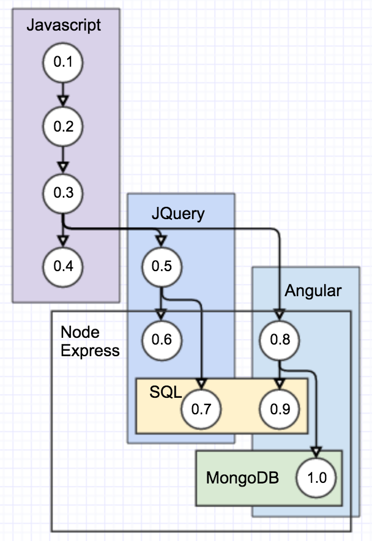

My Garage
=========

A rolling project that uses many basic technologies: JS, JQuery, AngularJS, SQL, Mongo. We'll create an Array "myCars" which can hold many car Objects.

Versions/features by branch:
============================

0.1 - console only
------------------
* vanilla JS
* generic CSS file
* all the action is in the console
* adding cars is hard-coded in the JS file

0.2 - basic input
-----------------
* builds off of 0.1
* text input fields
* button for adding the current input to the garage

0.3 - DOM output
----------------
* builds off of 0.2
* uses vanilla JS for DOM output

0.4 - Basic styling and interactivity
-------------------------------------
* builds off of 0.3
* some basic styling so things aren't so ugly...
* 0.41 - remove a car from the myCars array
* 0.42 - edit existing car (kinda)

0.5 - JQuery output to DOM
--------------------------
* builds off of 0.3
* converted to JQuery
* 0.51 - remove a car
* 0.52 - edit existing car (kinda)

0.6 - JQuery/JSON
----------------
* builds off of 0.5
* loads cars from a JSON file in addition to input from user

0.7 - JQuery/SQL
----------------
* builds off of 0.5
* SQL CRUD for persistent car data
* 0.71 - remove a car
* 0.72 - edit existing car

0.8 - Angular output to DOM
---------------------------
* builds off of 0.3
* basic project converted to Angular
* 0.81 - remove a car
* 0.82 - edit existing car (kinda)

0.9 - Angular/SQL
-----------------
* builds off of 0.8
* SQL CRUD for persistent car data
* 0.91 - remove a car
* 0.92 - edit existing car

1.0 - Angular/Mongo
-------------------
* builds off of 0.8
* Mongo CRUD for persistent car data
* 0.91 - remove a car
* 0.92 - edit existing car

The Car Object
--------------
* year
* make
* model
* picURL
* description
